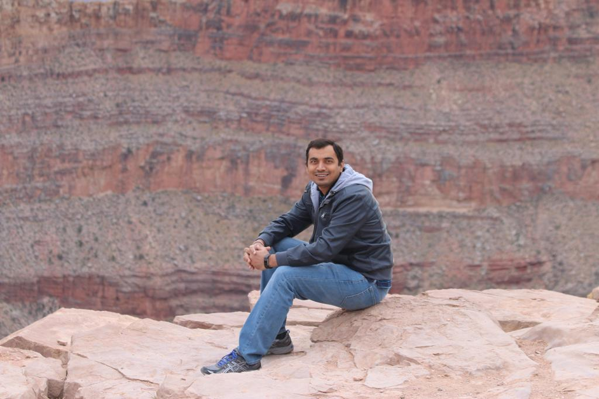

##  Me

Hi there, I am Jigar Vyas.

## Educations
I have Completed My,

        - Graduation: Electrical Engineering (MS-EE) 
          Year: December 2015
          Collage: NorthWestern Poliytechnic University
          University: NorthWestern Poliytechnic University
          City: Fremont
          State: California
          Country: USA
        - Bachelor: Electronics and Communications (BE-EC)
          Year: July 2006
          Collage: Shri S'ad Vidhya Mandal Institue Of Technology
          University: South Gujarat University
          City: Bharuch
          State: Gujarat
          Country: India
        - Diploma: Electronincs and Communications
          Year: July 2003
          Collage: B.S Patel Poliytechnic University
          University: Technical Education Board
          City: Mehsana
          State: Gujarat
          Country: India

## Work
At present working as Senior Network  Engineer in Verizon Digital Media Group since March 2016
