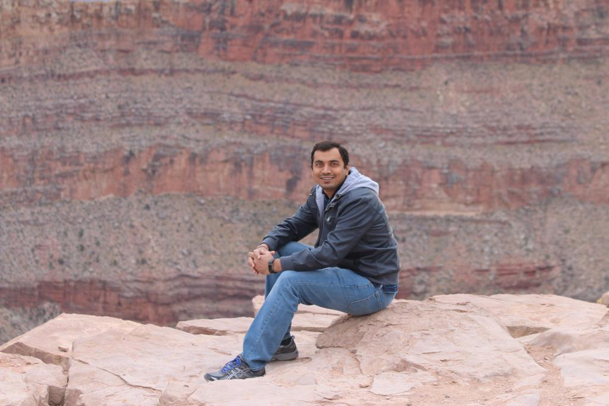

##  Jigar Vyas

Loaded From Index.md 

Hi,

If you are looking for such an awesome and fun loving Network Engineer in your 
organization then I am very confident that you will end your search after 
looking @ my skills and experience... :)...:)...!!!

I was a graduate student in NorthWestern Polytechnic University pursued Masters of 
Science in Electrical Engineering (Graduated in December 2015). I am a very 
dynamic and quick learner personality and keen to learn & adopt emerging 
technologies in the Networking world.

Currently, I am working as Network Engineer @ Edgio(Limelight/Edgecast) as a Senior 
Network Engineer. Bring the CDN PoP from the scratch and do Go-Live. Do 
the troubleshooting fo any problem in network. My focus has been testing the new 
network design, implement it in network and do the config automation for the same.